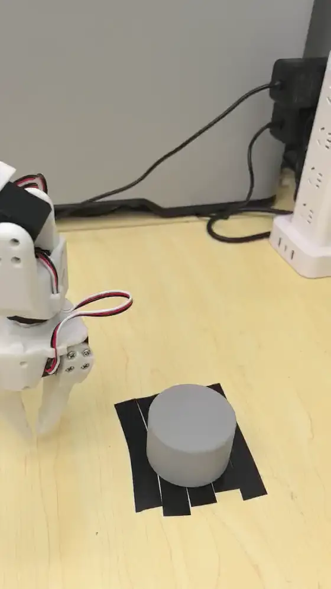
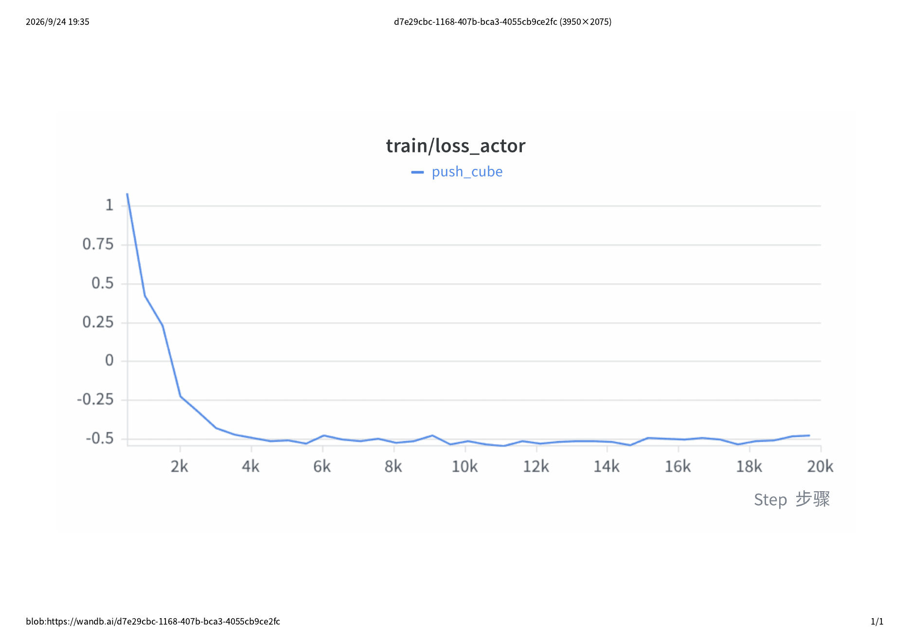
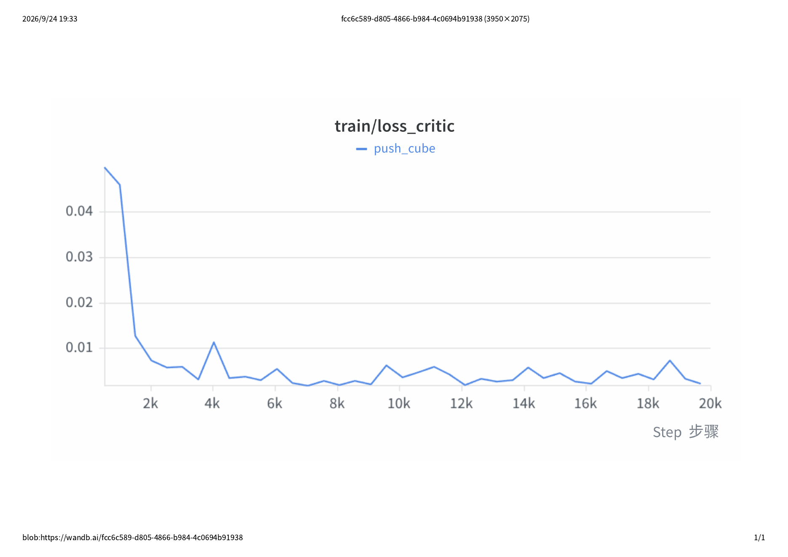

# so101-hilserl-pushing

基于 **HIL-SERL**（Human-in-the-Loop Sample-Efficient Reinforcement Learning）的真机强化学习项目，运行在 SO-ARM101 六自由度机械臂上，使用 LeRobot 框架完成「少量示教 → 在线自主探索 → 真机稳定执行」的完整闭环。

## 🎥 演示效果



> 21,000 步策略在真机上自主完成推物体（手机实拍，**原速** 10 秒）
>
> 用的是**动画 WebP**（1.8 MB）。同样内容转 GIF 要 14.4 MB 而且更糊 —— 原速下 GIF 压不住体积。

## 📊 成果概览

- **任务**：把物体（灰色方块 / 灰色圆柱）推进黑胶带目标区
- **示教数据**：12 条轨迹（约 2,300 帧，128×128 裁剪图）
- **训练**：21,000 步优化 ≈ 45 分钟真机在线训练
- **真机结果**：**20 次测试、每次换不同起始位置，20/20 全部成功** ✅
- **硬件**：SO-ARM101 从臂 + 主臂，第三视角 USB 相机，RTX 5070 Ti Laptop

## 🏗️ 技术方案

```
12 条示教 → 离线示范缓冲池
                ↓
   ┌──────────────────────────────┐
   │  learner（策略服务器 + 训练） │  ← gRPC 参数推送 / 数据回传
   └──────────────────────────────┘
                ↕
   ┌──────────────────────────────┐
   │  actor（真机执行 + 采数据）   │  ← 人在环：推歪了就接管
   └──────────────────────────────┘
                ↓
        在线 SAC，每集比上一集少干预
```

与模仿学习路线（同系列 `so101-act-grasping` / `so101-smolvla-grasping`）的核心区别：

| 项目 | 方法 | 数据量 | 特点 |
|---|---|---|---|
| so101-act-grasping | 模仿学习 ACT | 40 条示教 | 需要大量示教，泛化受限于示教分布 |
| so101-smolvla-grasping | 视觉语言动作模型 | — | 多任务、可泛化 |
| **so101-hilserl-pushing** | **在线强化学习 HIL-SERL** | **12 条示教 + 在线自采** | **样本效率高，失败能自己纠正** |

### 训练曲线

| Actor loss | Critic loss |
|---|---|
|  |  |

> 曲线导出自 wandb（项目 `push_cylinder`，21,000 步）。
> ⚠️ 训练指标**只往 wandb 送** —— 配置里 `wandb.enable=false` 时终端和日志里一个字都没有，详见 [03 模型训练](docs/03-模型训练.md)。

## 📁 目录结构

```
so101-hilserl-pushing/
├── configs/     # 录制/训练配置（立方体 & 圆柱两套，含探路配置）
├── docs/        # 技术文档 01~05
├── patches/     # LeRobot 本地补丁（移植必需，见 docs/05）
├── scripts/     # 录制、训练、部署脚本
├── verify/      # 配置自检脚本（跑真机前先过一遍）
├── urdf/        # 真机 IK 用的 URDF
├── data/        # 数据集说明（数据集托管在 HuggingFace）
├── results/     # 训练曲线图 + 演示视频（完整版走外链）
└── assets/      # README 演示动图（demo.gif / demo.webp）
```

## 🚀 快速复现

### 0. 环境

```bash
conda create -n lerobot python=3.12 -y && conda activate lerobot
cd /path/to/lerobot && pip install -e .
# ⚠️ 必须打上 patches/ 里的本地补丁，否则跑不起来，原因见 docs/05
git apply /path/to/so101-hilserl-pushing/patches/lerobot_local_patches.diff
```

### 1. 量本机参数（三件套，缺一不可）

```bash
# ① 起始姿势：用主臂摆好，读 teleoperate 的实时表（表头 NORM 其实是「度」）
python -m lerobot.scripts.lerobot_teleoperate ... --display_data=true --fps=2

# ② EE 围栏：只走「推物体实际会用到的区域」，别满场抡
python -m lerobot.scripts.lerobot_find_joint_limits ... --target_frame_name=gripper_frame_link

# ③ 裁剪框：先录 1 集探路（resize_size 必须为 null），再用官方工具拖框
python -m lerobot.rl.crop_dataset_roi --repo-id <user>/push_cylinder_probe1
```

### 2. 录示范

```bash
bash scripts/record.sh
```

### 3. 训练（★ 开训前务必确认 wandb 已开，见 docs/03）

```bash
bash scripts/train.sh
```

### 4. 真机部署 / 评估某个检查点

```bash
bash scripts/deploy.sh
```

## 📖 详细文档

| 文档 | 内容 |
|---|---|
| [01 项目概述](docs/01-项目概述.md) | HIL-SERL 原理、learner/actor 架构 |
| [02 数据采集](docs/02-数据采集.md) | 三件套测量、录制流程、标注要点 |
| [03 模型训练](docs/03-模型训练.md) | 超参、wandb、续训、缓冲池语义 |
| [04 部署与迭代](docs/04-部署与迭代.md) | 部署路径、冻结检查点、干预率怎么读 |
| [05 实验记录](docs/05-实验记录.md) | **移植补丁清单 + 踩坑档案** |

## 🙏 致谢

- 复现路线参考 [hxdoit](https://github.com/hxdoit) 的 HIL-SERL 分支
- 框架：[LeRobot](https://github.com/huggingface/lerobot)

## 📄 License

MIT License
